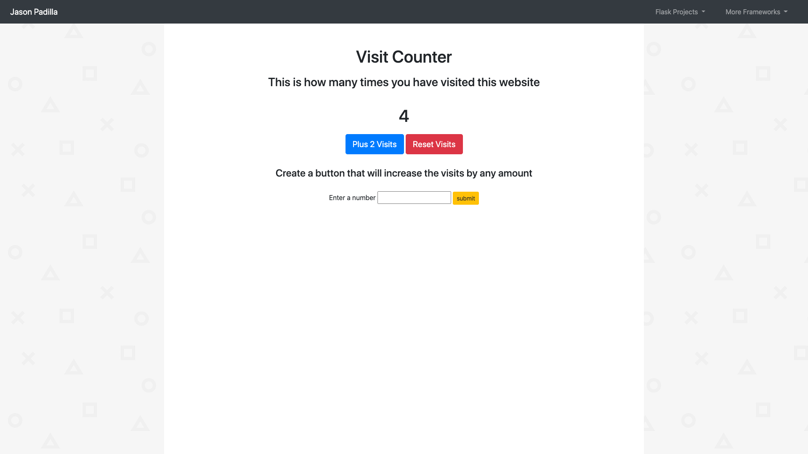
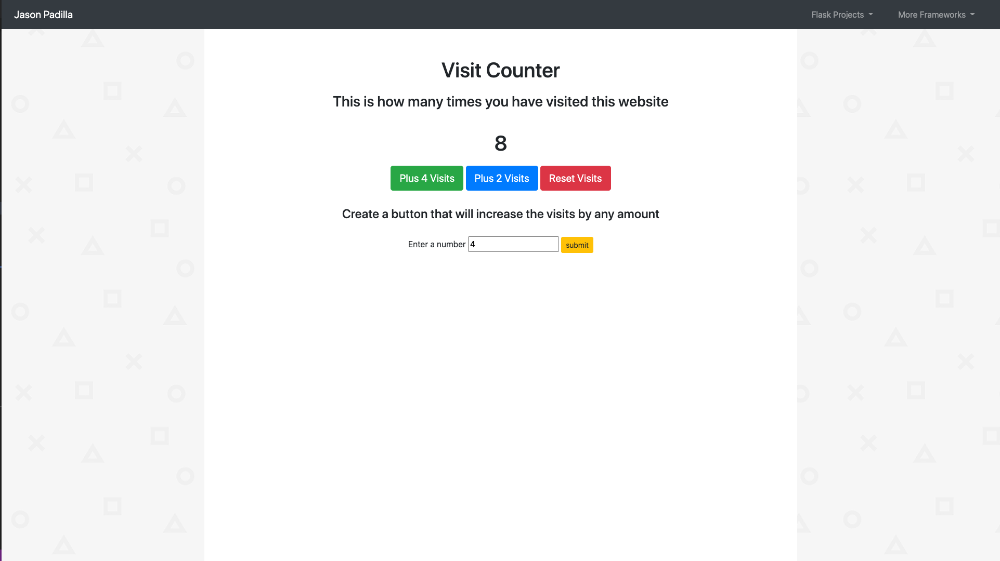

# WebCounter
This page is the first page that I created using the Flask framework. It is a simple web page that counts the amount of times a user has visited 
the page by keeping track of a session variable. It is also able to manually add 2 more views by clicking the "add 2 visits" button or the user can craete a button
the amount of views they would like to constantly add. The user can also reset the amount of views and it will also remove the custom button they have created.

# What I learned
* Flask Structure
* Flask Routes
* Flask Session
* Flask Jinja
 
# Screenshots

